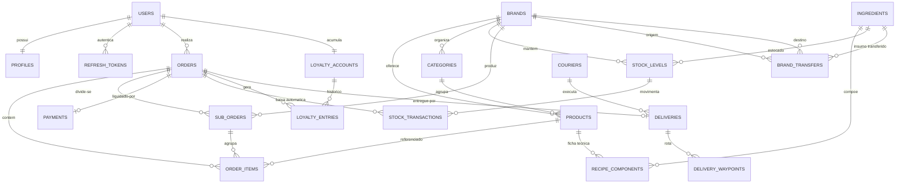

# Modelo de Dados (DER) — Gastro_Hub

> Fase 0 · issue #3 — DER completo. O dicionário de dados formal é a issue #29 (Fase 5).
>
> Legenda de implementação:
> - ✅ **implementado** nas migrations da Fase 0/1 (`users`, `profiles`, `refresh_tokens`, `brands`)
> - 🔜 **modelado**, migration na fase indicada

## Visão geral

## Entidades

### Identidade e acesso

#### `users` ✅ (issue #8)
| coluna | tipo | notas |
| --- | --- | --- |
| id | uuid PK | `gen_random_uuid()` |
| email | citext UNIQUE | case-insensitive |
| password_hash | text | Argon2id; `SELECT` explícito |
| full_name | text | `CHECK` não-vazio |
| cpf_enc | bytea | **pgcrypto** `pgp_sym_encrypt` (LGPD) |
| phone_enc | bytea | **pgcrypto** |
| role | user_role | `customer\|kitchen_staff\|brand_admin\|platform_admin\|courier` |
| status | user_status | `pending_verification\|active\|suspended` |
| email_verified_at, last_login_at | timestamptz | |
| created_at, updated_at, deleted_at | timestamptz | soft delete + trigger `set_updated_at` |

Índices: `uq_users_email`, `idx_users_role` (parcial `deleted_at IS NULL`),
`idx_users_status` (parcial), `idx_users_last_login_at`, `idx_users_active` (parcial).

#### `profiles` ✅ (issue #8)
`id` PK · `user_id` uuid UNIQUE FK→users (CASCADE) · `birth_date` date ·
`default_brand_id` uuid FK→brands (SET NULL) · `address` **jsonb** ·
`marketing_opt_in` bool · timestamps. Índice: `idx_profiles_default_brand`.

#### `refresh_tokens` ✅ (issue #7 / #11)
`id` PK · `user_id` FK→users (CASCADE) · `token_hash` text UNIQUE (SHA-256) ·
`family_id` uuid (rotação/detecção de reuso) · `user_agent` · `ip` inet ·
`expires_at` · `revoked_at` · `created_at`.
Índices: `idx_refresh_tokens_user`, `idx_refresh_tokens_family`,
`idx_refresh_tokens_expires` (parcial `revoked_at IS NULL`).

### Marcas e catálogo

#### `brands` ✅ (issue #3)
`id` PK · `name` · `slug` citext UNIQUE · `legal_name` · `cnpj_enc` bytea (pgcrypto) ·
`active` bool · `settings` **jsonb** · timestamps + soft delete.

#### `categories` 🔜 Fase 2 (issue #13)
`id` PK · `brand_id` FK→brands · `name` · `sort_order` int · `active` bool.
UNIQUE `(brand_id, name)`.

#### `products` 🔜 Fase 2 (issue #13)
`id` PK · `brand_id` FK→brands · `category_id` FK→categories ·
`name` · `description` · `price_cents` int `CHECK (price_cents >= 0)` · `currency` char(3) ·
`available` bool · `attributes` **jsonb** (atributos variáveis por marca) · timestamps.
Índices: `(brand_id, available)`, GIN em `attributes`.

### Pedidos e pagamento

#### `orders` 🔜 Fase 2 (issue #14)
`id` PK · `customer_id` FK→users · `status` order_status
(`cart\|awaiting_payment\|paid\|in_preparation\|ready\|completed\|cancelled`) ·
`total_cents` int · `placed_at` · timestamps. Índice: `(customer_id, status)`.

#### `order_items` 🔜 Fase 2
`id` PK · `order_id` FK→orders (CASCADE) · `sub_order_id` FK→sub_orders (SET NULL) ·
`product_id` FK→products · `brand_id` FK→brands · `quantity` int `CHECK (> 0)` ·
`unit_price_cents` int · `line_total_cents` int · `notes` text.

#### `sub_orders` 🔜 Fase 2 (issue #14 — subcomandas por cozinha)
`id` PK · `order_id` FK→orders (CASCADE) · `brand_id` FK→brands ·
`status` sub_order_status (`queued\|in_preparation\|ready\|delivered\|cancelled`) ·
`subtotal_cents` int · timestamps. UNIQUE `(order_id, brand_id)`.
> Apuração financeira separada por estabelecimento = soma de `sub_orders` por `brand_id`.

#### `payments` 🔜 Fase 2 (issue #16 — pagamento consolidado)
`id` PK · `order_id` FK→orders UNIQUE · `amount_cents` int · `method` ·
`status` (`pending\|authorized\|captured\|failed\|refunded`) ·
`provider_ref` · `processed_at`. Evento publicado em fila RabbitMQ.

### Estoque

#### `ingredients` 🔜 Fase 2 (issue #15)
`id` PK · `brand_id` FK→brands (nullable = insumo compartilhável) · `name` ·
`base_unit` (`g\|ml\|un`) · `active` bool.

#### `recipe_components` 🔜 Fase 2 (ficha técnica — issue #15)
`product_id` FK→products · `ingredient_id` FK→ingredients ·
`quantity` numeric `CHECK (> 0)` · `unit`. PK composta `(product_id, ingredient_id)`.

#### `stock_levels` 🔜 Fase 2 (issue #17)
`id` PK · `ingredient_id` FK→ingredients · `brand_id` FK→brands ·
`on_hand` numeric · `minimum` numeric `CHECK (>= 0)`.
Coluna gerada `below_minimum bool GENERATED ALWAYS AS (on_hand < minimum) STORED`.
UNIQUE `(ingredient_id, brand_id)`.

#### `stock_transactions` 🔜 Fase 2 (issue #17)
`id` PK · `stock_level_id` FK→stock_levels · `order_id` FK→orders (nullable) ·
`type` (`purchase\|consumption\|adjustment\|transfer_in\|transfer_out\|waste`) ·
`quantity` numeric (sinal por `type`) · `balance_after` numeric · `created_at`.

### Marketplace interno (transferência entre marcas)

#### `brand_transfers` 🔜 Fase 3 (issues #20/#23)
`id` PK · `from_brand_id` FK→brands · `to_brand_id` FK→brands
`CHECK (from_brand_id <> to_brand_id)` · `ingredient_id` FK→ingredients ·
`quantity` numeric `CHECK (> 0)` · `unit_cost_cents` int ·
`transfer_price_cents` int **`CHECK (transfer_price_cents > unit_cost_cents)`** (risco/regra do projeto) ·
`status` (`requested\|approved\|shipped\|received\|rejected`) · timestamps.

### Fidelidade

#### `loyalty_accounts` 🔜 Fase 2 (issue #18)
`id` PK · `customer_id` FK→users UNIQUE · `points_balance` int `CHECK (>= 0)` · `updated_at`.

#### `loyalty_entries` 🔜 Fase 2/3 (issues #18/#22)
`id` PK · `account_id` FK→loyalty_accounts · `order_id` FK→orders (nullable) ·
`brand_id` FK→brands (nullable — resgate em qualquer marca) ·
`type` (`earn\|redeem\|expire\|adjust`) · `points` int · `created_at`.

### Delivery

#### `couriers` 🔜 Fase 3 (issue #19)
`id` PK · `user_id` FK→users UNIQUE · `vehicle` · `active` bool · `current_region`.

#### `deliveries` 🔜 Fase 3 (issues #19/#21)
`id` PK · `order_id` FK→orders UNIQUE · `courier_id` FK→couriers (nullable) ·
`fee_cents` int · `region` · `status` (`pending\|assigned\|picking_up\|en_route\|delivered\|failed`) ·
`assigned_at` · `delivered_at`.

#### `delivery_waypoints` 🔜 Fase 3 (rota multimarca — issue #21)
`id` PK · `delivery_id` FK→deliveries (CASCADE) · `brand_id` FK→brands (nullable) ·
`seq` int · `lat` numeric · `lng` numeric · `reached_at`. UNIQUE `(delivery_id, seq)`.

## Convenções

- Todas as PKs são `uuid` (`gen_random_uuid()`), sem IDs sequenciais expostos.
- Dinheiro sempre em **centavos** (`*_cents int`), moeda `BRL`.
- Datas em `timestamptz`; `updated_at` mantido por trigger `set_updated_at()`.
- Soft delete (`deleted_at`) só onde há valor histórico (users, brands).
- `JSONB` para o que varia por marca (`products.attributes`, `profiles.address`, `brands.settings`);
  índice GIN quando houver filtro por chave.
- Regras de negócio críticas ficam em `CHECK` no banco, não só na aplicação
  (ex.: `transfer_price_cents > unit_cost_cents`, `quantity > 0`).
